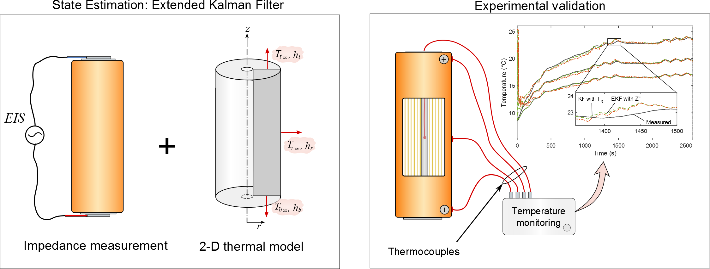

Temperature Estimation via Impedance and a 2-D Thermal Model 
============================================================



This repository contains the Matlab source code to appy an Extended Kalman Filter to monitor the 2-D temperature distribution of a 32113 lithium iron phosphate cell using single frequency electrochemical impedance measurements. 

This code accompanies the following paper:
Robert R. Richardson, Shi Zhao, David A. Howey, [On-board monitoring of 2-D spatially-resolved temperatures in cylindrical lithium-ion batteries: Part II. State estimation via impedance-based temperature sensing][4], Journal of Power Sources, 2016.

I would ask that you cite this paper if you want to use this code for 
your own research.
Note that Part I of this paper derives the thermal model used here. That paper is available [here][5] and its accompanying code available [here][6].

This code has been developed at the Department of Engineering Science of the University of Oxford. 
For information about our lithium-ion battery research, visit the [Howey Research Group][2] website.
If you are interested in our energy research, check out our research group website [Energy and Power Group][3].

Feel free to email the authors with any questions:  
[Robert Richardson](mailto:robert.richardson@eng.ox.ac.uk)  
[Shi Zhao](mailto:shi.zhao@eng.ox.ac.uk)  
[David Howey](mailto:david.howey@eng.ox.ac.uk) 

Requirements
============
You will need MATLAB to run this code. This code has been developed and 
tested in MATLAB R2015b and should work with later versions. 
Although it has not been tested with earlier MATLAB releases, it should 
also work with no or minor modifications.


 
Installation
============

##Option 1 - Downloading a .zip file##
Download a .zip file of the code at:

[https://github.com/robert-richardson/EKF-Impedance-2D-Temperature/archive/master.zip][7]

Then, unzip the folder in a chosen directory on your computer.

##Option 2 - Cloning the repository with Git##
To clone the repository, you will first need to have [Git][8] installed on 
your computer. Then, navigate to the directory where you want to clone the 
repository in a terminal, and type:
```
git clone https://github.com/robert-richardson/EKF-Impedance-2D-Temperature.git
```
The folder containing all the files should appear in your chosen directory.


Getting started
===============

Execution of the [MainScript.m](MainScript.m) file runs the simulation.
The simulation comprises a 2600 sec heat generation profile applied to a 2-D cylindrical battery.
The temperature is estimated using a thermal model corrected by electrochemical impedance measurements using an Extended Kalman Filter.
The evolution of the temperature at three locations on the cell surface and core as predicted by the EKF is compared with
experimental thermocouple measurements.

The MainScript file can also be read using Matlab Publish (rather than simply running the file) to generate a PDF or html file summarizing the file code and outputs. A published html resulting from this process is already available in the [html](/html) subfolder.


License
=======

This open-source MATLAB code is published under the BSD 3-clause License,
please read the `LICENSE.txt` file for more information.

[1]: http://arxiv.org
[2]: http://users.ox.ac.uk/~engs1053/
[3]: http://epg.eng.ox.ac.uk/

[4]: http://www.sciencedirect.com/science/article/pii/S0378775316308163
[5]: http://www.sciencedirect.com/science/article/pii/S0378775316308151
[6]: https://github.com/robert-richardson/Spectral-Thermal-Model-2D

[7]: https://github.com/robert-richardson/EKF-Impedance-2D-Temperature/archive/master.zip
[8]: https://git-scm.com/

